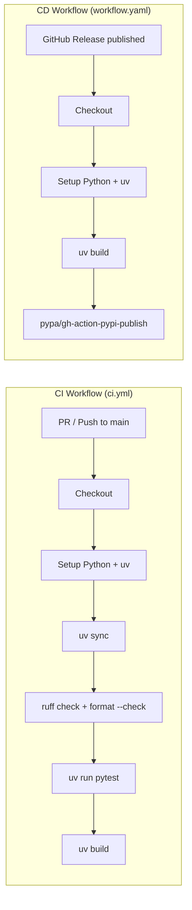
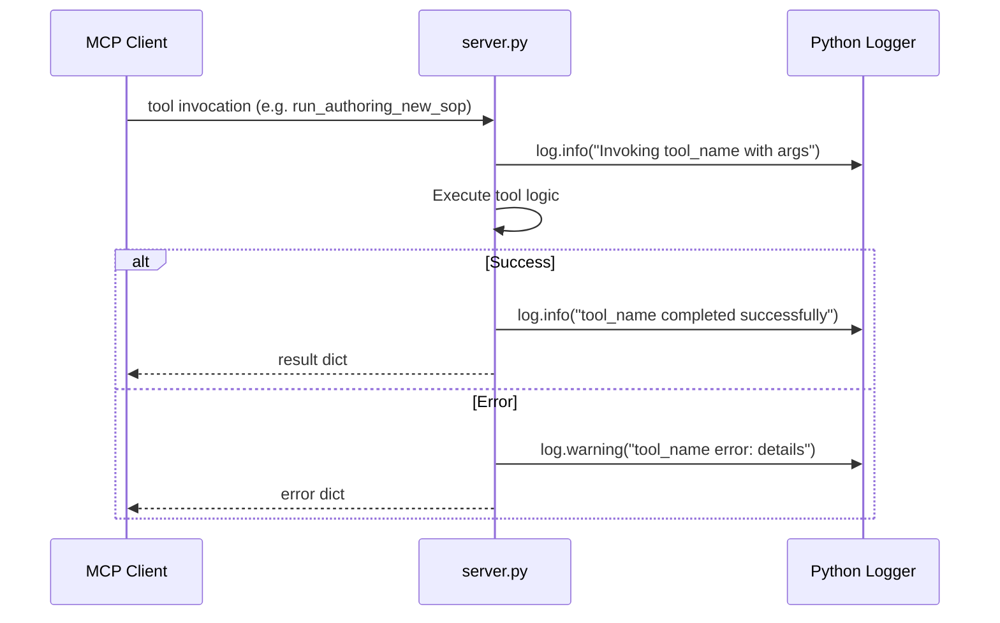

# Design Document: PyPI Publishing & CI/CD

## Overview

This design covers the changes needed to make `sop-mcp` a properly publishable PyPI package with automated CI/CD via GitHub Actions. The scope includes:

1. Enhancing `pyproject.toml` with full PyPI metadata, ruff configuration, and package data inclusion
2. Creating GitHub Actions workflows for CI (test + lint) and CD (build + publish)
3. Adding structured logging to all MCP tool invocations and feedback submissions

The design prioritizes minimal changes to existing code, leveraging prebuilt GitHub Actions and existing infrastructure.

## Architecture

The project structure after implementation:

```
.
├── .github/
│   └── workflows/
│       ├── ci.yml          # Test + lint on PR/push
│       └── workflow.yaml   # Build + publish on release (matches PyPI trusted publisher config)
├── src/
│   ├── __init__.py
│   ├── server.py           # MCP server (updated with logging)
│   ├── utils/
│   │   ├── __init__.py
│   │   └── sop_parser.py
│   └── sops/               # Bundled SOP markdown files
│       └── ...
├── tests/
│   ├── test_handler.py
│   └── test_parser.py
├── pyproject.toml           # Enhanced metadata + ruff config
├── README.md
└── LICENSE
```

### CI/CD Flow



### Logging Flow



## Components and Interfaces

### 1. pyproject.toml Enhancements

The existing `pyproject.toml` will be extended with:

**Metadata fields:**
```toml
[project]
name = "sop-mcp"
version = "0.1.0"
description = "An MCP server for guiding users through Standard Operating Procedures"
readme = "README.md"
license = { text = "MIT" }
requires-python = ">=3.12"
keywords = ["mcp", "sop", "standard-operating-procedure", "ai-agent"]
authors = [
    { name = "[author_name]", email = "[author_email]" },
]
classifiers = [
    "Development Status :: 3 - Alpha",
    "Intended Audience :: Developers",
    "License :: OSI Approved :: MIT License",
    "Programming Language :: Python :: 3",
    "Programming Language :: Python :: 3.12",
    "Programming Language :: Python :: 3.13",
]
dependencies = [
    "mcp>=1.0.0",
]

[project.urls]
Homepage = "https://github.com/ValueArchitectsAI/sop-mcp"
Repository = "https://github.com/ValueArchitectsAI/sop-mcp"
Issues = "https://github.com/ValueArchitectsAI/sop-mcp/issues"
```

**Ruff configuration:**
```toml
[tool.ruff]
target-version = "py312"
line-length = 120

[tool.ruff.lint]
select = ["E", "F", "I", "W"]
```

**Dev dependencies update:**
```toml
[tool.uv]
dev-dependencies = [
    "pytest>=8.0.0",
    "pytest-asyncio>=1.0.0",
    "ruff>=0.8.0",
]
```

**Package data inclusion** — SOP markdown files must be included in the distribution. Hatchling includes all files under `packages` by default, so the existing config already handles this since `src/sops/` is under `src/`. No additional configuration is needed for file inclusion.

### 2. CI Workflow (`.github/workflows/ci.yml`)

**Trigger:** Pull requests and pushes to `main` branch.

**Steps:**
1. `actions/checkout@v4` — Check out the repository
2. `actions/setup-python@v5` — Set up Python (version from `.python-version`)
3. `astral-sh/setup-uv@v4` — Install `uv`
4. `uv sync` — Install dependencies
5. `uv run ruff check .` — Lint check
6. `uv run ruff format --check .` — Format check
7. `uv run pytest` — Run tests
8. `uv build` — Verify package builds

**Design decisions:**
- Single job for simplicity (lint + test + build in sequence). The project is small enough that parallelizing into separate jobs adds complexity without meaningful time savings.
- Uses `astral-sh/setup-uv@v4` which is the official uv GitHub Action.
- Python version read from `.python-version` file for consistency with local dev.

### 3. CD Workflow (`.github/workflows/workflow.yaml`)

**Trigger:** GitHub release published.

**Steps:**
1. `actions/checkout@v4` — Check out the repository
2. `actions/setup-python@v5` — Set up Python
3. `astral-sh/setup-uv@v4` — Install `uv`
4. `uv build` — Build wheel and sdist
5. `pypa/gh-action-pypi-publish@release/v1` — Publish to PyPI

**Design decisions:**
- Filename is `workflow.yaml` to match the existing PyPI trusted publisher configuration for `ValueArchitectsAI/sop-mcp`.
- Uses Trusted Publishing (OIDC) — no API tokens needed. The trusted publisher is already configured on PyPI.
- The publish job requires `id-token: write` permission for OIDC.
- Build and publish are in the same workflow but could be split into separate jobs if attestation is desired later.

### 4. Logging in `server.py`

**Approach:** Add a module-level logger and wrap tool invocations with log statements.

```python
import logging

logger = logging.getLogger(__name__)
```

**Tool invocation logging** — Each tool handler will log at entry and exit:
- `logger.info("Invoking %s with args: %s", tool_name, args)` on entry
- `logger.info("%s completed successfully", tool_name)` on success
- `logger.warning("%s error: %s", tool_name, error_detail)` on error

**Feedback logging** — The `submit_sop_feedback` tool will additionally log:
- `logger.info("Feedback submitted for %s v%s", sop_name, version)` on success
- `logger.warning("Failed to write feedback for %s: %s", sop_name, error)` on file write failure

**Design decisions:**
- Uses Python's built-in `logging` module rather than a third-party library.
- Logging is added directly in the tool handler functions rather than via middleware/decorators, keeping the implementation simple and explicit.
- Log level: `INFO` for normal operations, `WARNING` for errors. This aligns with the MCP server being a background process where errors should be visible but not crash the server.

## Data Models

No new data models are introduced. The existing `SOP` class and its parsed fields remain unchanged.

**Configuration artifacts produced:**

| Artifact | Format | Purpose |
|----------|--------|---------|
| `pyproject.toml` | TOML | Package metadata, build config, ruff config |
| `.github/workflows/ci.yml` | YAML | CI workflow definition |
| `.github/workflows/workflow.yaml` | YAML | CD workflow definition |

**Workflow YAML schema (key fields):**

```yaml
# ci.yml
name: CI
on:
  push:
    branches: [main]
  pull_request:
    branches: [main]
jobs:
  test:
    runs-on: ubuntu-latest
    steps: [...]

# workflow.yaml
name: Publish to PyPI
on:
  release:
    types: [published]
permissions:
  id-token: write
jobs:
  publish:
    runs-on: ubuntu-latest
    environment: pypi
    steps: [...]
```

## Correctness Properties

*A property is a characteristic or behavior that should hold true across all valid executions of a system — essentially, a formal statement about what the system should do. Properties serve as the bridge between human-readable specifications and machine-verifiable correctness guarantees.*

Most requirements in this feature are configuration-based (TOML fields, YAML workflow definitions) and are best validated by example-based tests. The runtime behavioral requirements around logging yield the following properties:

### Property 1: Tool invocation entry logging

*For any* MCP tool invocation with any tool name and any set of arguments, the server SHALL emit an INFO-level log message that contains both the tool name and a representation of the arguments.

**Validates: Requirements 7.1**

### Property 2: Tool invocation success logging

*For any* MCP tool invocation that completes without error, the server SHALL emit an INFO-level log message that contains the tool name and indicates successful completion.

**Validates: Requirements 7.2**

### Property 3: Tool invocation error logging

*For any* MCP tool invocation that results in an error, the server SHALL emit a WARNING-level log message that contains both the tool name and the error details.

**Validates: Requirements 7.3**

### Property 4: Feedback submission logging includes SOP metadata

*For any* successful feedback submission, the server SHALL emit an INFO-level log message that contains the SOP name, the SOP version, and a timestamp.

**Validates: Requirements 8.1**

## Error Handling

### Logging Errors

- If the logging subsystem itself fails (e.g., misconfigured handler), the server MUST NOT crash. Python's `logging` module is designed to be resilient — `logging.error` will not raise exceptions.
- Feedback file write failures are caught and logged at WARNING level, then returned as error responses to the client (Requirement 8.2).

### CI/CD Errors

- CI workflow: If any step fails (lint, test, build), subsequent steps do not run (GitHub Actions default behavior with sequential steps).
- CD workflow: If `uv build` fails, the publish step is not reached. The `pypa/gh-action-pypi-publish` action is in a separate step that depends on the build step succeeding.

### Package Build Errors

- If SOP files are missing from the distribution, the server will raise `FileNotFoundError` at startup when scanning `src/sops/`. This is the existing behavior and is acceptable — the build configuration ensures files are included.

## Testing Strategy

### Unit Tests (example-based)

Unit tests validate specific configuration and behavior examples:

- **pyproject.toml metadata**: Parse the TOML file and assert required fields exist with expected values (authors, readme, license, urls, classifiers, keywords).
- **Ruff configuration**: Parse `pyproject.toml` and verify `[tool.ruff]` section has correct target-version, line-length, and lint select rules.
- **Logger configuration**: Assert that `server.py` has a module-level `logger = logging.getLogger(__name__)`.
- **Workflow YAML validation**: Parse the CI and CD workflow files and verify they contain expected triggers, steps, and action references.

### Property-Based Tests

Property tests validate universal logging behavior using `hypothesis`:

- **Property 1**: Generate random tool names and argument dicts, invoke the logging wrapper, assert the log output contains the tool name and arguments.
- **Property 2**: Generate random tool names, simulate successful completion, assert the log output contains the tool name and success indicator.
- **Property 3**: Generate random tool names and error messages, simulate error completion, assert the WARNING log contains the tool name and error message.
- **Property 4**: Generate random SOP names and version strings, simulate feedback submission logging, assert the log contains the SOP name, version, and a timestamp pattern.

### Property-Based Testing Configuration

- **Library**: `hypothesis` (Python's standard PBT library)
- **Minimum iterations**: 100 per property (hypothesis default is 100 examples)
- **Tag format**: `# Feature: pypi-publish-and-ci, Property N: <property_text>`

### Test Organization

Tests are added to the existing `tests/` directory:
- `tests/test_logging.py` — Property tests for logging behavior (Properties 1–4) and unit tests for logger configuration
- `tests/test_pyproject.py` — Example tests for pyproject.toml metadata and ruff config
- `tests/test_workflows.py` — Example tests for GitHub Actions workflow YAML structure

### Running Tests

```bash
# All tests
uv run pytest

# Just logging property tests
uv run pytest tests/test_logging.py -v
```
