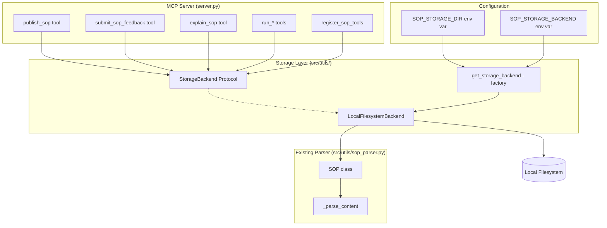

# Design Document: SOP Storage Abstraction

## Overview

This design introduces a storage abstraction layer for the SOP MCP Server that decouples SOP file operations from the physical storage location. The current implementation hardcodes `SOPS_DIR = Path(__file__).parent.parent / "sops"`, which causes data loss when the server runs via `uvx` (ephemeral package cache). The abstraction provides a `StorageBackend` protocol, a `LocalFilesystemBackend` implementation with configurable paths, automatic seeding from the bundled directory, and ephemeral storage warnings. The architecture is designed so that future backends (e.g., S3) can be added by implementing the protocol.

## Architecture



The key architectural change is that `server.py` no longer imports `SOPS_DIR` or calls filesystem functions directly. Instead, it obtains a `StorageBackend` instance from the factory function and passes it to tool handlers. The `SOP` class retains its parsing responsibility but no longer owns the storage path resolution — the backend handles that.

### Design Decisions

1. **Protocol over ABC**: We use `typing.Protocol` for `StorageBackend` rather than `abc.ABC`. This enables structural subtyping (duck typing with type checking), which is more Pythonic and doesn't force inheritance. Future backends (S3, etc.) just need to implement the right methods.

2. **Factory function over class hierarchy**: `get_storage_backend()` reads environment variables and returns the appropriate backend. This keeps configuration logic centralized and simple.

3. **Seeding at init time**: The `LocalFilesystemBackend` seeds from the bundled directory during `__init__` when the persistent directory is empty. This is a one-time operation that ensures a smooth first-run experience.

4. **Feedback stored alongside SOPs**: Feedback files (`feedback.md`) are stored in the same backend directory structure as SOPs, so they follow the same persistence guarantees.

5. **Minimal refactor of SOP class**: The `SOP` class keeps its parsing logic but gains an optional `base_dir` parameter so it can parse from any directory, not just the hardcoded `SOPS_DIR`. The module-level functions (`list_available_sops`, `list_versions`, etc.) are superseded by backend methods.

## Components and Interfaces

### StorageBackend Protocol

```python
from typing import Protocol

class StorageBackend(Protocol):
    """Protocol defining the interface for SOP storage backends."""

    @property
    def is_ephemeral(self) -> bool:
        """Whether this storage backend is ephemeral (data may be lost)."""
        ...

    def read_sop(self, name: str, version: str | None = None) -> str:
        """Read SOP file content by name and optional version.
        
        Returns the raw markdown content string.
        Raises FileNotFoundError if the SOP or version doesn't exist.
        """
        ...

    def write_sop(self, name: str, version: str, content: str) -> None:
        """Write SOP content to storage.
        
        Creates the SOP directory if needed.
        """
        ...

    def list_sops(self) -> list[str]:
        """Return sorted list of available SOP names."""
        ...

    def list_versions(self, name: str) -> list[str]:
        """Return sorted list of versions for a given SOP."""
        ...

    def sop_exists(self, name: str, version: str | None = None) -> bool:
        """Check whether a specific SOP (and optionally version) exists."""
        ...

    def read_feedback(self, name: str) -> str | None:
        """Read feedback file content for an SOP, or None if no feedback exists."""
        ...

    def write_feedback(self, name: str, content: str) -> None:
        """Write or overwrite the feedback file for an SOP."""
        ...

    def append_feedback(self, name: str, entry: str) -> None:
        """Append a feedback entry to the SOP's feedback file."""
        ...
```

### LocalFilesystemBackend

```python
class LocalFilesystemBackend:
    """Storage backend that reads/writes SOP files on the local filesystem.
    
    Attributes:
        base_dir: The root directory for SOP storage.
        is_ephemeral: Whether this directory is considered ephemeral.
    """

    def __init__(self, base_dir: Path, is_ephemeral: bool = False, seed_dir: Path | None = None) -> None:
        """Initialize the backend.
        
        Args:
            base_dir: Root directory for SOP storage.
            is_ephemeral: Whether this storage is ephemeral.
            seed_dir: Optional directory to seed from if base_dir has no SOPs.
        """
        ...
```

The `LocalFilesystemBackend` implements all `StorageBackend` methods using `pathlib.Path` operations. It follows the existing directory layout convention: `{base_dir}/{sop_name}/v{version}.md` for SOP files and `{base_dir}/{sop_name}/feedback.md` for feedback.

### Factory Function

```python
import os
from pathlib import Path

BUNDLED_SOPS_DIR = Path(__file__).parent.parent / "sops"

def get_storage_backend() -> StorageBackend:
    """Create and return the appropriate storage backend based on configuration.
    
    Environment variables:
        SOP_STORAGE_BACKEND: "bundled" to use the package's bundled directory directly.
                             Defaults to "local" (persistent local filesystem).
        SOP_STORAGE_DIR: Override the default persistent directory path.
                         Only used when SOP_STORAGE_BACKEND is "local" (or unset).
    """
    ...
```

### Module Structure

New files:
- `src/utils/storage_backend.py` — `StorageBackend` protocol definition
- `src/utils/storage_local.py` — `LocalFilesystemBackend` implementation and factory function

Modified files:
- `src/utils/__init__.py` — exports `StorageBackend`, `LocalFilesystemBackend`, `get_storage_backend`
- `src/server.py` — use `get_storage_backend()` instead of `SOPS_DIR`; pass backend to tool handlers
- `src/utils/sop_parser.py` — add optional `base_dir` parameter to `SOP.__init__`; keep parsing logic intact
- `pyproject.toml` — add `platformdirs` dependency

## Data Models

### Directory Layout (unchanged)

```
{storage_root}/
  {sop_name}/
    v{version}.md
    feedback.md
```

This layout is identical to the current `src/sops/` structure. The only change is that `{storage_root}` is now configurable rather than hardcoded.

### Configuration Resolution Order

1. If `SOP_STORAGE_BACKEND=bundled` → use `src/sops/` directly, `is_ephemeral=True`
2. If `SOP_STORAGE_DIR` is set → use that path, `is_ephemeral=False`, seed from bundled
3. Default → use `platformdirs.user_data_dir("sop-mcp")`, `is_ephemeral=False`, seed from bundled

### SOP Class Changes

The `SOP` class gains an optional `base_dir: Path | None` parameter in `__init__`. When provided, it overrides the module-level `SOPS_DIR` for path resolution. This allows the backend to construct `SOP` instances pointing at any directory. The `from_content` and parsing methods remain unchanged.

### Seeding Logic

```
if base_dir has no subdirectories with v*.md files:
    if seed_dir exists and has subdirectories with v*.md files:
        copy each sop_name/ directory from seed_dir to base_dir
```

Only SOP version files (`v*.md`) are copied during seeding. Feedback files are not copied.


## Correctness Properties

*A property is a characteristic or behavior that should hold true across all valid executions of a system — essentially, a formal statement about what the system should do. Properties serve as the bridge between human-readable specifications and machine-verifiable correctness guarantees.*

### Property 1: Write-read round trip

*For any* valid SOP name, version string, and content string, writing the content to the backend via `write_sop(name, version, content)` and then reading it back via `read_sop(name, version)` should return a string equal to the original content.

**Validates: Requirements 2.5, 2.6**

### Property 2: Listing reflects written SOPs

*For any* set of distinct SOP names and versions written to a fresh backend, `list_sops()` should return a sorted list containing exactly those SOP names, and `list_versions(name)` should return exactly the versions written for that name.

**Validates: Requirements 2.3, 2.7**

### Property 3: Seeding copies all bundled SOPs

*For any* non-empty seed directory containing SOP subdirectories with versioned files, initializing a `LocalFilesystemBackend` with an empty `base_dir` and that `seed_dir` should result in `list_sops()` returning exactly the same SOP names as exist in the seed directory, and reading any seeded SOP should return content equal to the seed source.

**Validates: Requirements 3.1, 3.3**

### Property 4: Ephemeral warning if and only if ephemeral backend

*For any* SOP content published or feedback submitted through a tool handler, the response dictionary contains an ephemeral storage warning if and only if the underlying `StorageBackend.is_ephemeral` is `True`.

**Validates: Requirements 4.1, 4.2, 4.3, 4.4**

### Property 5: Path validation rejects invalid paths

*For any* string that is not a valid filesystem path (e.g., contains null bytes, or is empty), the storage configuration validation should raise a `ValueError`.

**Validates: Requirements 5.4**

## README Documentation

The `README.md` must be updated to document storage configuration. A new "Storage Configuration" section should be added after the "Usage" section, covering:

1. Default behavior: SOPs are stored in a persistent platform-specific data directory (`~/.local/share/sop-mcp` on Linux, `~/Library/Application Support/sop-mcp` on macOS, `%LOCALAPPDATA%/sop-mcp` on Windows). Bundled SOPs are automatically copied there on first run.

2. Environment variables:

| Variable | Description | Default |
|---|---|---|
| `SOP_STORAGE_DIR` | Override the storage directory path | `platformdirs` user data dir |
| `SOP_STORAGE_BACKEND` | Set to `"bundled"` to use the package's built-in directory (ephemeral with `uvx`) | `"local"` |

3. Example MCP client configuration with a custom storage directory:

```json
{
  "mcpServers": {
    "sop-mcp": {
      "command": "uvx",
      "args": ["sop-mcp"],
      "env": {
        "SOP_STORAGE_DIR": "/path/to/my/sops"
      }
    }
  }
}
```

4. A note about ephemeral storage: when using `SOP_STORAGE_BACKEND=bundled` or when no persistent directory is configured and the server runs via `uvx`, published SOPs and feedback may be lost when the package cache is refreshed.

The existing "How It Works" section should also be updated to reflect that SOPs are stored in the configured storage directory rather than always in `src/sops/`.

## Error Handling

| Scenario | Behavior |
|---|---|
| SOP not found in backend | `read_sop` raises `FileNotFoundError` with descriptive message |
| Version not found for existing SOP | `read_sop` raises `FileNotFoundError` listing available versions |
| Write to read-only filesystem | `write_sop` raises `OSError`; server returns error dict to client |
| Invalid storage path in config | `get_storage_backend` raises `ValueError` at startup |
| Seed directory missing or empty | Seeding is skipped silently; backend starts with empty storage |
| Feedback file doesn't exist yet | `append_feedback` creates the file with a header before appending |
| Permission denied on storage dir | `__init__` raises `PermissionError`; server fails to start with clear message |

All errors from the storage layer propagate as standard Python exceptions. The server's tool handlers catch these and return `{"error": str(e)}` dicts to the MCP client, consistent with the existing error handling pattern in `server.py`.

## Testing Strategy

### Property-Based Testing

Library: `hypothesis` (the standard Python PBT library)

Each property test MUST run a minimum of 100 iterations. Each test MUST be tagged with a comment referencing the design property:

```python
# Feature: sop-storage-abstraction, Property 1: Write-read round trip
# Validates: Requirements 2.5, 2.6
```

Property tests use `hypothesis` strategies to generate:
- Random SOP names (lowercase strings with underscores, 3+ segments)
- Random version strings (semver-like: `{int}.{int}.{int}`)
- Random SOP content strings (valid markdown with required sections)
- Random boolean flags for `is_ephemeral`

Each correctness property (1–5) maps to a single `@given`-decorated test function.

### Unit Testing

Unit tests complement property tests by covering:
- Specific examples: known SOP content, known directory structures
- Edge cases: empty seed directory, missing bundled dir, empty SOP name
- Configuration scenarios: each env var combination (examples from requirements 5.1–5.3, 7.1–7.2)
- Error conditions: invalid paths, missing files, permission errors
- Integration: server startup with different configurations

Unit tests use `pytest` with `tmp_path` fixtures for isolated filesystem operations.

### Test Organization

- `tests/test_storage_backend.py` — property tests and unit tests for `LocalFilesystemBackend`
- `tests/test_storage_config.py` — unit tests for `get_storage_backend` factory and configuration
- `tests/test_server_integration.py` — tests verifying server tools use the storage backend correctly
