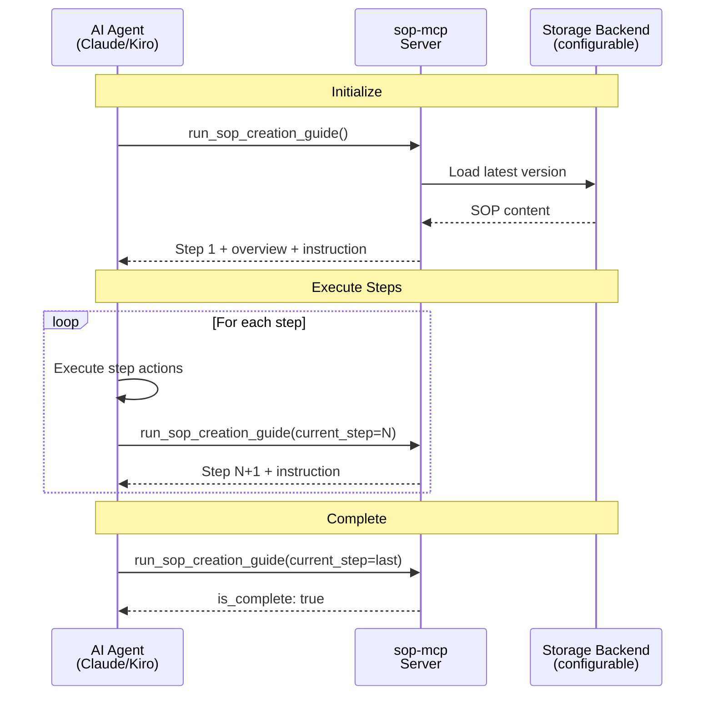

# sop-mcp

[](https://pypi.org/project/sop-mcp/)
[](https://pypi.org/project/sop-mcp/)
[](https://github.com/ValueArchitectsAI/sop-mcp/blob/main/LICENSE)

An MCP server that guides AI agents through Standard Operating Procedures (SOPs) step by step, using RFC 2119 requirement levels. Instead of dumping an entire procedure on the agent (which it will summarize or skip), sop-mcp feeds one step at a time and forces actual execution.

## Quick Install

| IDE | One-Click Install |
|:---:|:---:|
| Kiro | [](https://kiro.dev/launch/mcp/add?name=sop-mcp&config=%7B%22command%22%3A%20%22uvx%22%2C%20%22args%22%3A%20%5B%22sop-mcp%22%5D%7D) |
| Cursor | [](https://cursor.com/en/install-mcp?name=sop-mcp&config=eyJjb21tYW5kIjogInV2eCIsICJhcmdzIjogWyJzb3AtbWNwIl19) |
| VS Code | [](https://vscode.dev/redirect/mcp/install?name=sop-mcp&config=%7B%22type%22%3A%20%22stdio%22%2C%20%22command%22%3A%20%22uvx%22%2C%20%22args%22%3A%20%5B%22sop-mcp%22%5D%7D) |

Or add manually to any MCP client:

```json
{
  "mcpServers": {
    "sop-mcp": {
      "command": "uvx",
      "args": ["sop-mcp"]
    }
  }
}
```

## Why?

Agents tend to summarize or skip steps when given a full procedure. Feeding steps one at a time forces actual execution. Each SOP becomes a dedicated MCP tool (`run_<sop_name>`) that the agent discovers naturally in its tool list.

## How It Works

```
Agent calls run_sop_creation_guide()        → gets step 1 + instruction to execute
Agent executes step 1 actions
Agent calls run_sop_creation_guide(current_step=1)  → gets step 2
  ... repeats ...
Agent calls run_sop_creation_guide(current_step=8)  → is_complete: true
```

Every response includes an `instruction` field that tells the agent to *act*, not just read.

## Tools

| Tool | Description |
|------|-------------|
| `explain_sop` | List all available SOPs, or get details about a specific one |
| `publish_sop` | Publish a new or updated SOP with automatic semver bumping |
| `submit_sop_feedback` | Submit improvement feedback for a specific SOP |
| `run_<sop_name>` | Step-by-step execution of an SOP (one tool per SOP, registered dynamically) |

## Creating SOPs

The built-in `run_sop_creation_guide` tool walks agents through the full authoring process:

1. **Prepare** — gather process info, identify stakeholders, collect existing docs
2. **Structure** — define metadata, scope, parameters, and document skeleton
3. **Document** — write detailed step-by-step instructions with decision points
4. **Apply RFC 2119** — classify each action as MUST, SHOULD, or MAY
5. **Enrich** — add troubleshooting, best practices, examples, and references
6. **Review** — validate with SMEs and end users, run through the checklist
7. **Finalize** — incorporate feedback, publish via `publish_sop`, notify stakeholders
8. **Maintain** — schedule reviews, collect feedback, keep the SOP current

After publishing, restart the server to register the new `run_<sop_name>` tool.

## Storage Configuration

By default, SOPs are stored in the bundled `src/sops/` directory (ephemeral — data may be lost if the package cache refreshes).

To persist SOPs, set `SOP_STORAGE_DIR`:

```json
{
  "mcpServers": {
    "sop-mcp": {
      "command": "uvx",
      "args": ["sop-mcp"],
      "env": {
        "SOP_STORAGE_DIR": "/path/to/my/sops"
      }
    }
  }
}
```

Bundled SOPs are automatically seeded into the custom directory on first run.

## Writing an SOP

Every SOP markdown file must include:

- A level-1 heading (`# Title`)
- A `**Document ID**:` field (lowercase, underscores, min 3 words)
- A `**Version:**` field (semver)
- An `## Overview` section
- One or more `### Step N:` sections

Use RFC 2119 keywords (MUST, SHOULD, MAY) to define requirement levels.

## Publishing

Call `publish_sop` with the full markdown content and a `change_type`:

| Type | Effect | Example |
|------|--------|---------|
| `major` | Breaking change | 1.2.0 → 2.0.0 |
| `minor` | New feature | 1.2.0 → 1.3.0 |
| `patch` | Bugfix | 1.2.0 → 1.2.1 |

New SOPs always start at v1.0.0.

## SOP Naming Convention

| Element | Format | Example |
|---------|--------|---------|
| Folder name | lowercase, underscores | `sop_creation_guide` |
| Document ID | same as folder name | `sop_creation_guide` |
| Tool name | `run_` + folder name | `run_sop_creation_guide` |
| Version file | `v` + semver | `v1.0.0.md` |

## Development

Requires Python 3.10+ and [uv](https://docs.astral.sh/uv/).

```bash
uv sync              # install dependencies
uv run pytest        # run tests
uv run sop-mcp       # start server locally
```

## Architecture



## License

MIT
