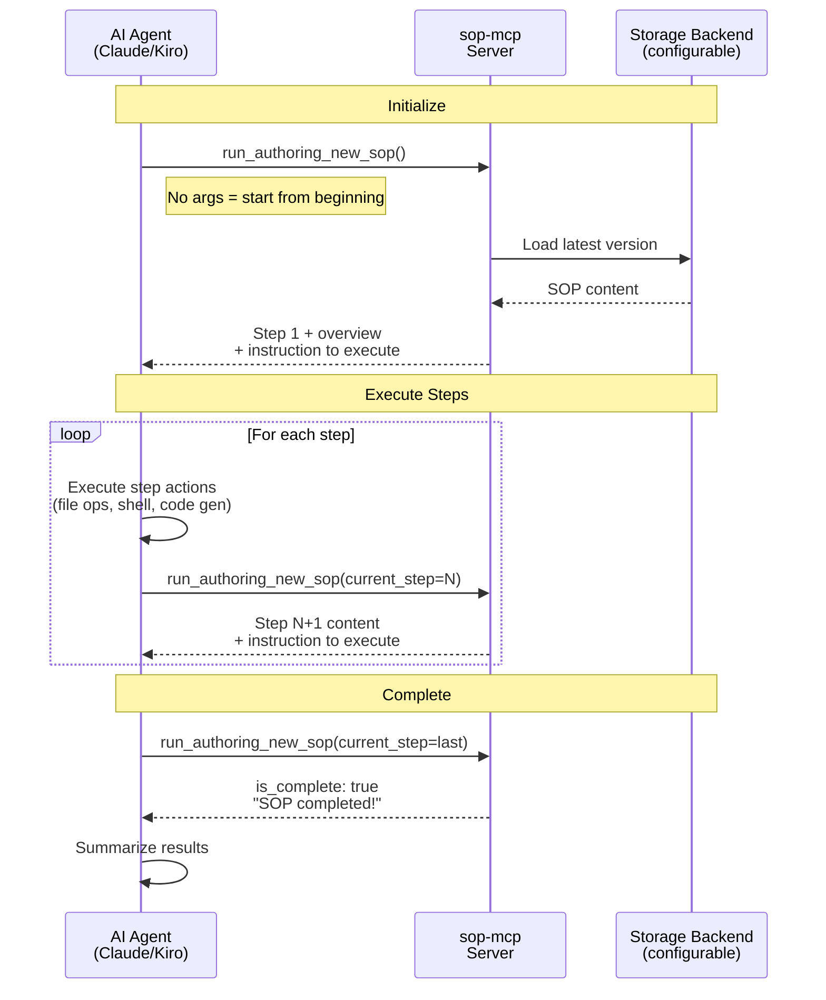

# sop-mcp

An MCP server that guides AI agents through Standard Operating Procedures (SOPs) step by step using RFC 2119 requirement levels.

## Architecture



## Tools

| Tool | Description |
|------|-------------|
| `explain_sop` | List all available SOPs, or get details about a specific one |
| `publish_sop` | Publish a new or updated SOP with automatic semver bumping |
| `run_<sop_name>` | Step-by-step execution of an SOP (one tool per SOP, registered dynamically) |

## How It Works

1. SOPs are stored as versioned markdown files in `<storage_dir>/<sop_name>/v<version>.md`
2. On startup, the server initializes the configured storage backend and registers a `run_<sop_name>` tool for each discovered SOP
3. On first run, bundled SOPs are automatically copied (seeded) into the persistent storage directory
4. New SOPs can be published at runtime via `publish_sop` (server restart needed to register the new tool)

### Tool Parameters

| Parameter | Type | Required | Description |
|-----------|------|----------|-------------|
| `current_step` | int | no | Step to advance from. Omit to start from step 1. |
| `version` | string | no | Semver version to use (e.g. `"1.0"`). Defaults to latest. |

The response includes an `instruction` field that tells the agent to execute the step content using its available tools, not just summarize it. After completing a step's actions, the agent calls the tool again to get the next step.

## SOP Naming Convention

| Element | Format | Example |
|---------|--------|---------|
| Folder name | lowercase, underscores | `authoring_new_sop` |
| Document ID | same as folder name | `authoring_new_sop` |
| Tool name | `run_` + folder name | `run_authoring_new_sop` |
| Version file | `v` + semver | `v1.0.0.md` |

The Document ID is specified in the markdown via `**Document ID**: authoring_new_sop` and must contain at least 3 words.

## Installation

Requires Python 3.12+ and [uv](https://docs.astral.sh/uv/).

```bash
uv sync
```

## Usage

### With an MCP client

Add to your MCP client configuration:

```json
{
  "mcpServers": {
    "sop-mcp": {
      "command": "uvx",
      "args": ["sop-mcp"]
    }
  }
}
```

### Local development

```bash
uv run sop-mcp
```

### Running tests

```bash
uv run pytest
```

## Storage Configuration

By default, SOPs are stored in a persistent platform-specific data directory and bundled SOPs are automatically seeded on first run:

- **macOS**: `~/Library/Application Support/sop-mcp`
- **Linux**: `~/.local/share/sop-mcp`
- **Windows**: `%LOCALAPPDATA%/sop-mcp`

### Environment Variables

| Variable | Description | Default |
|---|---|---|
| `SOP_STORAGE_DIR` | Override the storage directory path | `platformdirs` user data dir |
| `SOP_STORAGE_BACKEND` | Set to `"bundled"` to use the package's built-in directory (ephemeral with `uvx`) | `"local"` |

### Example: Custom Storage Directory

```json
{
  "mcpServers": {
    "sop-mcp": {
      "command": "uvx",
      "args": ["sop-mcp"],
      "env": {
        "SOP_STORAGE_DIR": "/path/to/my/sops"
      }
    }
  }
}
```

### Ephemeral Storage Note

When using `SOP_STORAGE_BACKEND=bundled`, SOPs are read from and written to the package's built-in `src/sops/` directory. If the server is installed via `uvx`, this directory lives inside an ephemeral cache — published SOPs and feedback may be lost when the cache is refreshed. The server will include a warning in `publish_sop` and `submit_sop_feedback` responses when operating in ephemeral mode.

## Writing an SOP

Every SOP markdown file must include:

- A level-1 heading (`# Title`)
- A `**Document ID**:` field with a lowercase underscore-separated name (min 3 words)
- A `**Version:**` field
- An `## Overview` section
- One or more `### Step N:` sections

Use RFC 2119 keywords (MUST, SHOULD, MAY) to define requirement levels. Run the built-in `run_authoring_new_sop` tool for guided SOP creation.

## Publishing an SOP

Call the `publish_sop` tool with the full markdown content and a `change_type`:

- `major` — breaking change (1.2.0 → 2.0.0)
- `minor` — new feature (1.2.0 → 1.3.0)
- `patch` — bugfix (1.2.0 → 1.2.1)

New SOPs start at v1.0.0 regardless of change_type.

## License

MIT
