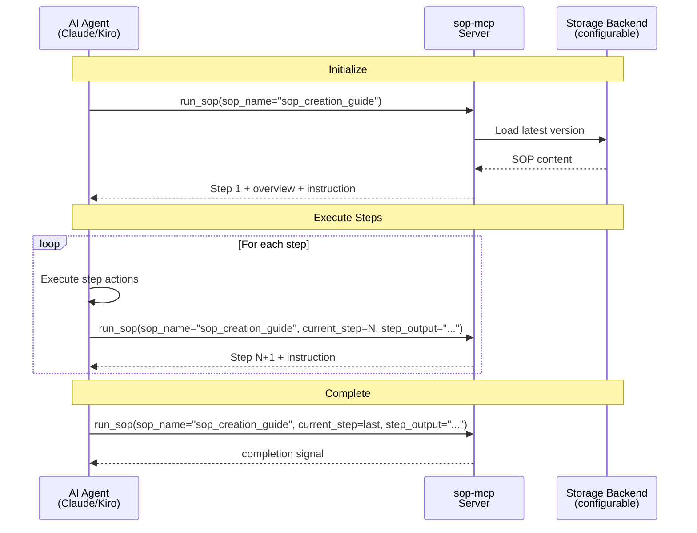

# sop-mcp

[](https://pypi.org/project/sop-mcp/)
[](https://pypi.org/project/sop-mcp/)
[](https://github.com/ValueArchitectsAI/sop-mcp/blob/main/LICENSE)

An MCP server that guides AI agents through Standard Operating Procedures (SOPs) step by step, using RFC 2119 requirement levels. Instead of dumping an entire procedure on the agent (which it will summarize or skip), sop-mcp feeds one step at a time and forces actual execution.

## Quick Install

| Kiro | Cursor | VS Code |
|:---:|:---:|:---:|
| [](https://kiro.dev/launch/mcp/add?name=sop-mcp&config=%7B%22command%22%3A%20%22uvx%22%2C%20%22args%22%3A%20%5B%22sop-mcp%22%5D%7D) | [](https://cursor.com/en/install-mcp?name=sop-mcp&config=eyJjb21tYW5kIjogInV2eCIsICJhcmdzIjogWyJzb3AtbWNwIl19) | [](https://vscode.dev/redirect/mcp/install?name=sop-mcp&config=%7B%22type%22%3A%20%22stdio%22%2C%20%22command%22%3A%20%22uvx%22%2C%20%22args%22%3A%20%5B%22sop-mcp%22%5D%7D) |

Or add manually to any MCP client:

```json
{
  "mcpServers": {
    "sop-mcp": {
      "command": "uvx",
      "args": ["sop-mcp"]
    }
  }
}
```

## Why?

Agents tend to summarize or skip steps when given a full procedure. Feeding steps one at a time forces actual execution. Each SOP becomes a dedicated MCP tool (`run_sop`) that the agent discovers naturally in its tool list.

## How It Works

```
Agent calls run_sop(sop_name="sop_creation_guide")           → gets step 1 + instruction to execute
Agent executes step 1 actions
Agent calls run_sop(sop_name="sop_creation_guide", current_step=1, step_output="...")  → gets step 2
  ... repeats ...
Agent calls run_sop(sop_name="sop_creation_guide", current_step=8, step_output="...")  → completion signal
```

Every response includes an `instruction` field that tells the agent to *act*, not just read.

## Tools

| Tool | Description |
|------|-------------|
| `publish_sop` | Publish a new or updated SOP with automatic semver bumping |
| `submit_sop_feedback` | Submit improvement feedback for a specific SOP |
| `run_sop` | Step-by-step execution of any SOP, with `sop_name` parameter |

## Discovering SOPs

SOPs are exposed as MCP resources, so agents can list and read them before starting execution.

| Method | URI | Description |
|--------|-----|-------------|
| `list_resources` | — | Returns all available SOPs with name, version, step count, and overview |
| `read_resource` | `sop://{sop_name}` | Read the full latest SOP markdown |
| `read_resource` | `sop://{sop_name}?version=1.0` | Read a specific version |

For clients that don't support the MCP resource protocol, resources are also exposed as tools automatically via `ResourcesAsTools`.

This lets agents load the full SOP content upfront if needed — for example, to understand scope before committing to a multi-step run.

## Creating SOPs

The built-in `sop_creation_guide` SOP walks agents through the full authoring process (call `run_sop` with `sop_name="sop_creation_guide"`):

1. **Prepare** — gather process info, identify stakeholders, collect existing docs
2. **Structure** — define metadata, scope, parameters, and document skeleton
3. **Document** — write detailed step-by-step instructions with decision points
4. **Apply RFC 2119** — classify each action as MUST, SHOULD, or MAY
5. **Enrich** — add troubleshooting, best practices, examples, and references
6. **Review** — validate with SMEs and end users, run through the checklist
7. **Finalize** — incorporate feedback, publish via `publish_sop`, notify stakeholders
8. **Maintain** — schedule reviews, collect feedback, keep the SOP current

After publishing, restart the server to register the new SOP.

## The `step_output` Field

The `run_sop` tool accepts an optional `step_output` string parameter (required when `current_step >= 1`). This is where the LLM submits its concrete work product for the completed step — specific values, names, dates, and details rather than summaries.

The server accepts `step_output` but does not store or process it. The field exists purely to force the LLM to produce detailed output that lands in the conversation's tool-call history. When all steps are complete, the LLM can reference its own `step_output` submissions to compile a comprehensive final document. State lives entirely in the LLM's conversation context, keeping the server stateless.

### Request/response flow

```
# Step 1: Initial call — no step_output needed
Agent calls run_sop(sop_name="my_sop")
→ Response: Step 1 instruction

# Step 2: Agent submits step 1 output
Agent calls run_sop(
    sop_name="my_sop",
    current_step=1,
    step_output="Registration: VALID, Number: BRN-2024-0738291"
)
→ Response: Step 2 instruction

# Step 3: Agent submits step 2 output
Agent calls run_sop(
    sop_name="my_sop",
    current_step=2,
    step_output="Insurance: Hartford Financial, Policy: HFS-GL-4829173"
)
→ Response: Step 3 instruction

# Completion: Agent submits final step output
Agent calls run_sop(
    sop_name="my_sop",
    current_step=3,
    step_output="Compliance: All checks passed, Certificate: CC-2024-9182"
)
→ Response: Completion signal
```

At completion, the LLM uses its conversation history of `step_output` submissions to compile the final document with all concrete values.

## Storage Configuration

By default, SOPs are stored in the bundled `src/sops/` directory (ephemeral — data may be lost if the package cache refreshes).

To persist SOPs, set `SOP_STORAGE_DIR`:

```json
{
  "mcpServers": {
    "sop-mcp": {
      "command": "uvx",
      "args": ["sop-mcp"],
      "env": {
        "SOP_STORAGE_DIR": "/path/to/my/sops"
      }
    }
  }
}
```

Bundled SOPs are automatically seeded into the custom directory on first run.

## Writing an SOP

Every SOP markdown file must include:

- A level-1 heading (`# Title`)
- A `**Document ID**:` field (lowercase, underscores, min 3 words)
- A `**Version:**` field (semver)
- An `## Overview` section
- One or more `### Step N:` sections

Use RFC 2119 keywords (MUST, SHOULD, MAY) to define requirement levels.

## Publishing

Call `publish_sop` with the full markdown content and a `change_type`:

| Type | Effect | Example |
|------|--------|---------|
| `major` | Breaking change | 1.2.0 → 2.0.0 |
| `minor` | New feature | 1.2.0 → 1.3.0 |
| `patch` | Bugfix | 1.2.0 → 1.2.1 |

New SOPs always start at v1.0.0.

## SOP Naming Convention

| Element | Format | Example |
|---------|--------|---------|
| Folder name | lowercase, underscores | `sop_creation_guide` |
| Document ID | same as folder name | `sop_creation_guide` |
| Tool name | `run_sop` with `sop_name=` folder name | `run_sop(sop_name="sop_creation_guide")` |
| Version file | `v` + semver | `v1.0.0.md` |

## Development

Requires Python 3.10+ and [uv](https://docs.astral.sh/uv/).

```bash
uv sync              # install dependencies
uv run pytest        # run tests
uv run sop-mcp       # start server locally
```

## Architecture



## License

MIT
